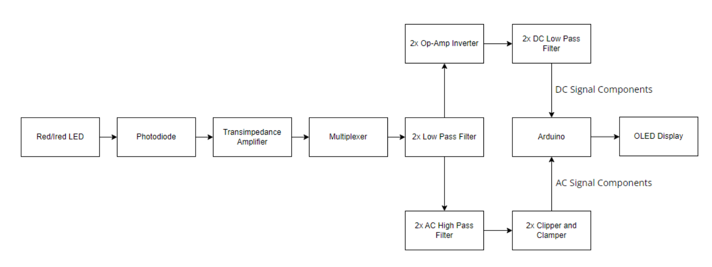

# Real-Time SpO2 and Heart Rate Monitor

**Authors:** Muhammad Athar, Jason Huang  
**Project Type:** Electrical Engineering Integrated Design Project  
**Platform:** Arduino + Discrete Analog Circuitry + OLED Display

## 🔍 Project Overview

This project implements a real-time pulse oximeter that measures:
- Blood oxygen saturation (%SpO2)
- Heart rate (BPM)
- Heartbeat waveform

The system uses an SpO2 sensor (Nellcor DS-100A), analog signal processing circuits, an Arduino microcontroller, and an OLED display. The sensor data is processed through a multi-stage analog filtering and amplification pipeline before being read and visualized by the Arduino.

> 📊 Final output includes: real-time BPM, %SpO2, and a scrolling waveform display.

---

## 🛠️ System Architecture

The project includes both hardware and software components:

### 🔧 Hardware Design
- **Sensor Input:** Red/IR LEDs + Photodiode (Nellcor DS-100A)
- **Signal Chain:**
  - Transimpedance amplifier (current-to-voltage conversion)
  - Multiplexer (red/IR signal separation)
  - Low-pass + high-pass filters (noise removal, DC offset rejection)
  - Clipper & clamper (voltage protection for Arduino)
  - DC processing chain (separate op-amp path for DC values)

- **Microcontroller:** Arduino Uno
- **Display:** 128x32 OLED (I2C)

### 🖥️ Software Logic (Arduino)
- Frequency calculation via peak detection
- Calculation of SpO2 using:
SpO2 = 110 - 25R, where R = AC_red/DC_red * AC_IR/DC_IR
- Real-time waveform plotting (20ms sampling)
- Display update every 2s (BPM and %SpO2)

---

## 📂 Contents

| File / Folder            | Description                                     |
|--------------------------|-------------------------------------------------|
| `/Report.pdf`            | Full technical report                           |
| `/Presentation.pdf`      | Project presentation slides                     |
| `/Images/`               | Block diagrams, schematics, circuit images     |
| `/Arduino_Code/`         | Final Arduino code with waveform display logic |
| `README.md`              | Project overview (this file)                   |

---

## 🧪 Verification & Testing

- **LTSpice** simulations were used to verify signal filtering stages.
- **Hardware validation** was done using Apple Watch SE and a commercial SpO2 sensor for comparison.
- **Measured BPM** was typically within ±10% accuracy of commercial devices.
- **SpO2 values** fluctuated between 80–100%, with occasional inaccuracies due to hardware limitations (e.g., DC signal imbalance).

---

## 📈 Key Learnings

- Analog signal chain design (TIAs, filters, MUX, protection circuits)
- Hands-on integration of hardware and software
- Practical experience with Arduino real-time signal processing
- Debugging sensor-based systems under timing constraints

---

## 📷 Sample Output

  
*A high-level system block diagram*

  
*OLED display showing real-time waveform, BPM, and SpO2*
